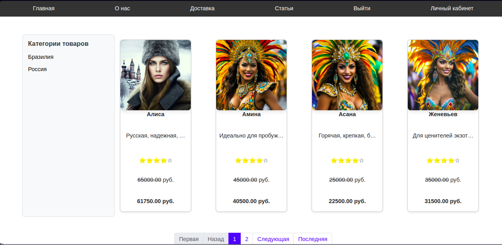
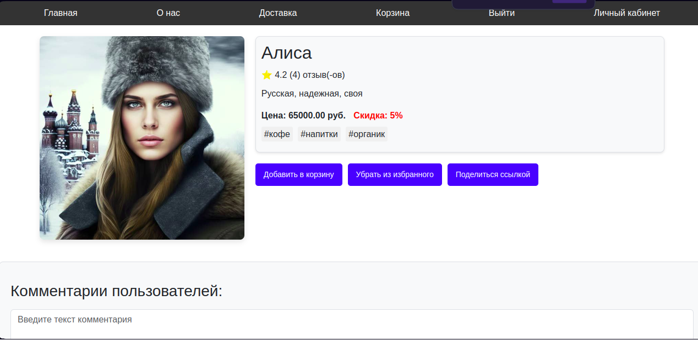
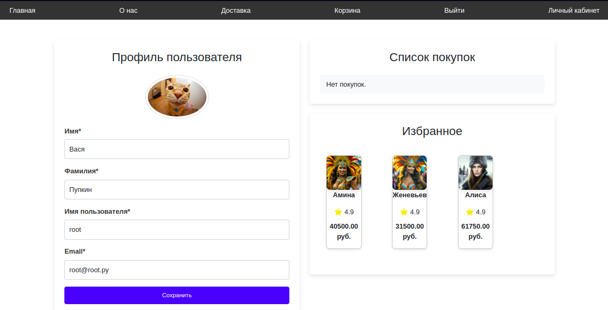

# Django e-commerce online shop

Добро пожаловать в наш онлайн-магазин услуг ведущих для новогоднего корпоратива! Мы предлагаем уникальную платформу, где вы можете легко найти и забронировать профессиональных ведущих для вашего корпоративного мероприятия. Наша цель — сделать процесс организации новогоднего корпоратива простым и приятным, предоставляя вам доступ к лучшим специалистам в этой области.

<p align='center'>


</p>



## Особенности

- **Широкий выбор ведущих**: Мы собрали команду опытных ведущих, которые могут адаптироваться к любому стилю мероприятия, будь то формальная встреча или веселая вечеринка.
- **Удобный поиск**: Используйте наш интуитивно понятный интерфейс для поиска ведущих по различным критериям, таким как опыт, стиль, отзывы и цена.
- **Прозрачные цены**: Все услуги представлены с четкими ценами, без скрытых платежей. Вы можете легко сравнить предложения и выбрать наиболее подходящее.
- **Отзывы клиентов**: Ознакомьтесь с отзывами других клиентов, чтобы сделать обоснованный выбор. Мы ценим мнение наших пользователей и стремимся к постоянному улучшению качества услуг.
- **Безопасная оплата**: Мы обеспечиваем безопасные методы оплаты, чтобы вы могли сосредоточиться на планировании вашего мероприятия, не беспокоясь о финансовых транзакциях.
- **Удобство для соискателей**: Воспользуйтесь удобным редактором размещения своих услуг на нашем сайте.
- **Дешборды и аналитика**: Получайте самую свежую аналитику о просмотрах вашей карточки, настраивайте продвижение, узнавайте своего заказчика.



## Как это работает

- **Регистрация**: Создайте учетную запись на нашей платформе, чтобы получить доступ ко всем функциям.
- **Поиск ведущих**: Используйте фильтры для поиска ведущих, которые соответствуют вашим требованиям.
- **Бронирование**: Выберите понравившегося ведущего и забронируйте его услуги на нужную дату.
- **Оплата**: Произведите оплату через нашу безопасную платформу.
- **Подтверждение**: Получите подтверждение бронирования и оставайтесь на связи с вашим ведущим для обсуждения деталей мероприятия.



## Примечание автора
- Это действительно сайт подбора ведущего для корпоратива. (Да, он задумывался как онлайн магазин кофе)
- Все изображения, карточки, услуги - сгенерированы нейросетями. Совпадения с реальными людьми и событиями случайны.
- Весь фронт писал как умел, может когда-то научусь в JS (или найдётся добряш скучающий фронтендер)

## Вклад
Это мой пет-проект. Я начал его чтобы получше изучить функциональность и мощь Django. Некоторые вещи подглядел, некоторые придумал сам. Так, что если вы решите внести свой вклад и предложить свои идеи - буду только рад и с удовольствем поучусь у вас. Пожалуйста, создавайте pull-запросы или issues.

-**[Что уже сделано](./readme_docs/done.md)**
-**[Что предстоит сделать](./readme_static/task.md)**

## Инструкция по запуску проекта:
1. Склонируйте репозиторий 
```
git clone https://github.com/Richman-24/coffeeShop.git
```
2. Разверните виртуальное окружение, установите зависимости
3. Создайте файл .env с переменными окружения (по примеру .env.example)

<-- 4. Разверните докер контейнер -->

### Автор работы
[Дреев Максим](https://github.com/richman-24) <br>
[telegram: @richman24](https://t.me/richman_24)
